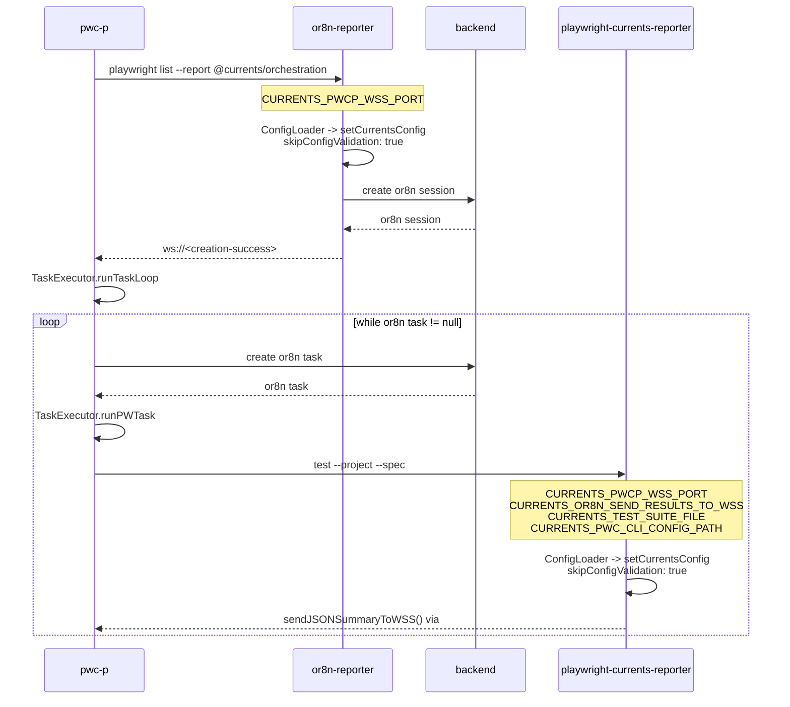
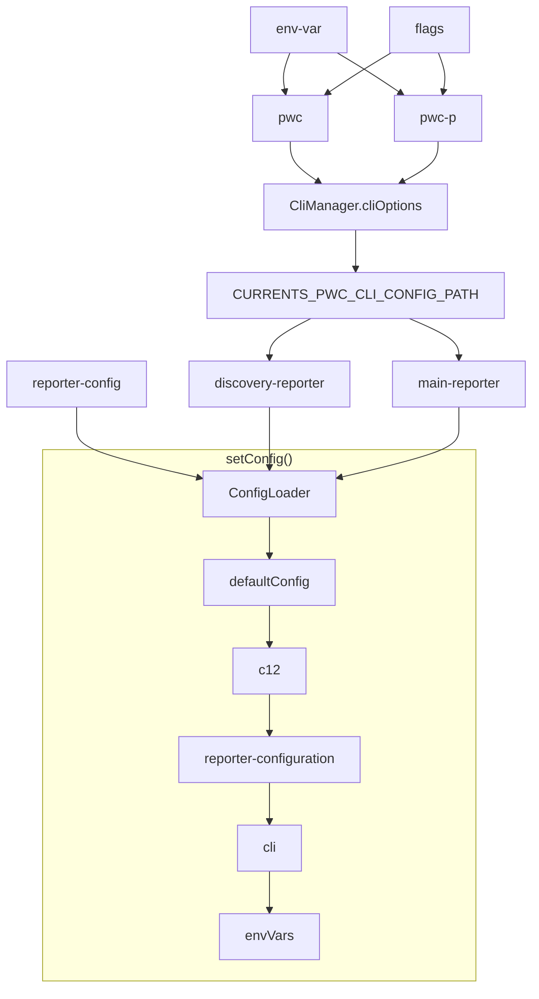

# Reference

## Orchestration

## Configuration

- `pwc` and `pwc-p` are CLI utils - they get CLI arguments which can have values set via env variables according to `Option` configuraiton.
- `pwc` and `pwc-p` serialize CLI flags and save it to `CURRENTS_PWC_CLI_CONFIG_PATH`
- `reporter-config` is the configuration that users provide via `playwright.config.ts`
- `c12` is the configurtion from `currents.config.ts` and alike
- reporters read the file contents from `CURRENTS_PWC_CLI_CONFIG_PATH` and merge the config using `setConfig()` function

## Tips

- use `getConfig` whenever it's possible
- don't use defaults in CLI options - they will override c12 configuration, use `defaultConfig` instead
- you can access certain config values directly from source - for example `debug` or `inspect`
